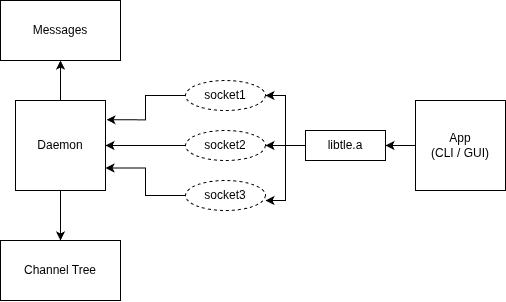
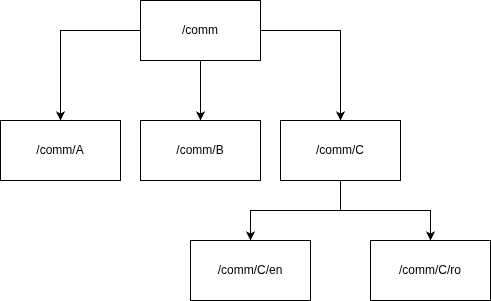

# Telemetry

Communication system in UNIX with hierarchical channels:

- An userspace daemon along with a library exposing its functionality, to provide short-message distribution among multiple participants.  

Messages are organized into hierarchical distribution channels: 
- A message sent to a parent channel is received by all subscribers of that channel and its child channels. 
- Parent channels are created automatically when a daemon registers the first subscriber on a child channel.  

There are two types of participants:  
- Publisher - send messages to a channel
- Subscriber - receive messages from channels they are subscribed to

A possible set of channels at a given time could be:  

- A: `/comm/messaging/channel_a`  
- B: `/comm/messaging/channel_b`  
- C: `/comm/messaging`  
- D: `/comm`  

For this example, the following statements are correct:  

1. A message sent to channel **A** will be received only by **A**.  
2. A message sent to **C** will be received by **A** and **B**.  
3. A message sent to **D** will be received by **A**, **B**, **C**, and **D**.  
4. When channel **A** is created, the parent channels **C** and **D** will automatically become available.  


# Project Structure

The projects consists of three components:
- daemon (Server)
- libtlm (API that exposes the server's functionality)
- application (links libtlm and communicates with the daemon)

Each module is compiled separately via makefiles.



## Daemon
The daemon is the server part of the application. Each channel is considered being part of a tree.
The daemon owns the channel tree and manages brodcast of messages amongst participants.

The daemon is responsible of:
- creating a UNIX socket and listening on it
- managing connections with clients
- handling messages from clients

Clients are served sequentially.
The daemon is compiled via a makefile.

### Channel Tree
Each channel is considered being a node in a tree. A node in this tree contains:
- channel's name
- children nodes (other channels)
- socket file descriptors of subscribers



## Server API (libtlm)
The libtlm static library serves the purpose of an API. It is used by applications to:
- subscribe a participant to a channel
- post a message to a channel
- register a callback for a participant

### Handles
A connection is handled via a handle structure responsible for:
- channel information
- client socket
- callback mechanism
- last message received and message count

The library is compiled via a makefile as a static library `libtlm.a`. This library is then linked by applications.

### Callback
When a callback function is registered for a subscriber, a new thread is spawned where incoming messages are read. Then, the user callback function is called.

## Application level
For testing purposes, we provide some minimal applications to simulate multiple publishers and subscribers.

To run them, do the following:
- Compile the project:
```bash
# in project root
make 
```
- Start the daemon
```bash
cd daemon
./daemon
```

- Start subscribers and publishers
```bash
cd application

# start subscribers
./bin/sub1
./bin/sub2
./bin/sub3

# start publishers
./bin/pub1
./bin/pub2
```
## GUI
For interactivity, we decided to build a GUI for the application. The GUI is built with GTK.

The GUI allows creating subscribers and publishers on different channels and then panes in which you can do specific operations.

To run it:
- Compile the project:
```bash
# in project root
make 
```
- Start the daemon
```bash
cd daemon
./daemon
```
- Start the GUI
```bash
cd gui
./gui
```

## References
- Sockets man page: https://man7.org/linux/man-pages/man7/unix.7.html
- GTK: https://www.gtk.org/